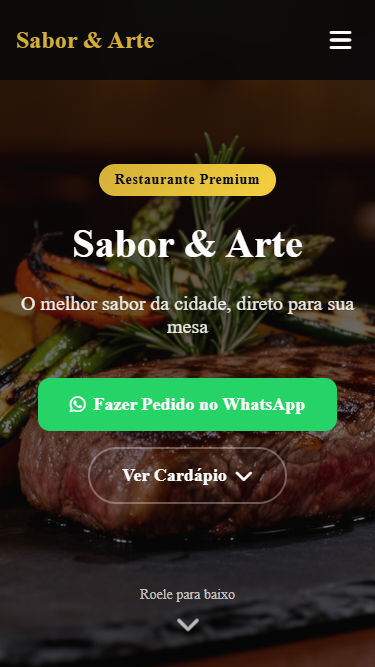
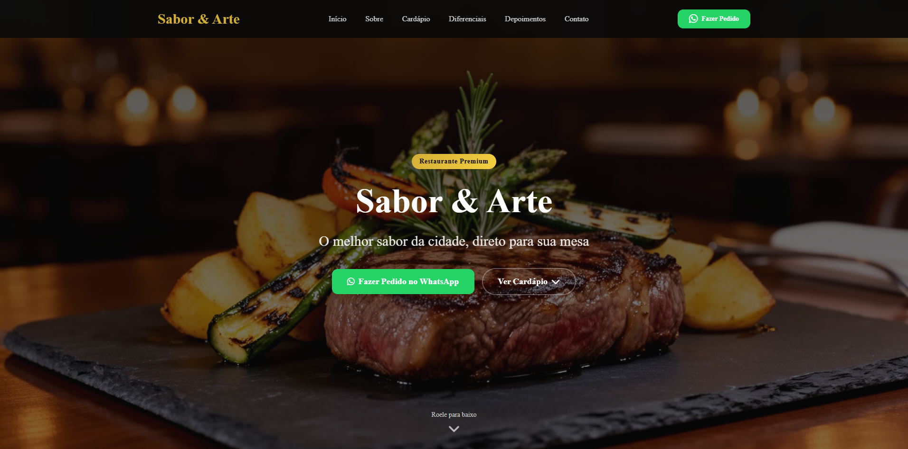

<h1 align="center">Sabor & Arte – Landing Page</h1>

<p align="center">
  Projeto de landing page completa para um restaurante fictício chamado “Sabor & Arte”, construída em HTML, CSS e JavaScript, podendo ser usada em um fluxo simples ou integrada a um bundler como Vite.
</p>

<p align="center">
  
  
  
  
  
</p>


### 💻 Sobre o projeto
Sabor & Arte - Landing Page é um projeto criado para praticar HTML, CSS e Javascript.

| Mobile | Desktop |
|---------|--------|
|  |  |

O desafio consistiu em reproduzir fielmente o visual e comportamento (header fixo, navegação, seções, botões, cards, etc.), mantendo responsividade e boa organização de código, mas sem depêndencia de frameworks.

### ⚙️ Funcionalidades
Header fixo com:

- Menu de navegação desktop

- Menu mobile com ícone que alterna entre “hambúrguer” e “X”

Seções estruturadas:

- Hero com CTA para WhatsApp

- Sobre (história, anos de tradição, valores do restaurante)

- Cardápio com grid de pratos, preços, badges (“Mais pedido”, “Prato do dia”) e botão “Pedir no WhatsApp” por prato

- Diferenciais com 6 cards e ícones

- Depoimentos com 4 clientes e resumo de avaliação (4.9 de 5, 500+ avaliações)

- Localização com mapa do Google Maps e cards de endereço, horário e contato

- Contato com 4 métodos (WhatsApp, Telefone, Instagram, Email)

- Footer com links rápidos, contatos, redes sociais e ano automático

- Layout totalmente responsivo (mobile-first)

### 🎨 Layout
Como o layout foi construído diretamente em código, não há link público de protótipo, mas a estrutura visual segue esta organização:

- Header + Hero: topo com navegação e imagem de destaque em tela cheia

- Sobre: imagem do interior do restaurante + texto + badge “15+ anos”

- Cardápio: 4 cards de pratos em grid, com imagem e CTA

- Diferenciais: 6 cards com ícones coloridos

- Depoimentos: 4 cartões + selo de nota geral

- Localização: mapa + 3 cards de informações

- Contato: 4 cartões clicáveis com diferentes canais

- Footer: informações finais e links sociais

### 🚀 Como executar o projeto
1. Clonar ou baixar o repositório

```bash
git clone https://github.com/henrymzs/restaurant-page.git
cd restaurant-page
```

2. Abrir o projeto
Opção simples (somente HTML, CSS, JS):
- Abra o arquivo index.html diretamente no navegador.

Opção com Vite:
```bash
# Com Bun (recomendado - mais rápido)
bun install
bun run dev
```
```bash
# OU com npm (alternativa)
npm install
npm run dev
```

Depois, acesse a URL indicada no terminal (geralmente http://localhost:5173).

Pré-requisitos
- Navegador moderno

- (Opcional, para usar Vite)
    Node.js instalado
    Gerenciador de pacotes (npm)

### 🛠 Tecnologias
- HTML5

- CSS3 (layout responsivo, grid/flexbox, efeitos de hover)

- JavaScript (menu mobile, ano dinâmico no footer, scroll suave)

- Font Awesome (ícones)

### 💪 Como contribuir para o projeto
1. Faça um fork do repositório

2. Crie uma branch para a sua feature:
```bash
git checkout -b minha-feature
```

3. Commit suas alterações:
```bash
git commit -m "feat: minha nova feature"
```

4. Envie a branch:
```bash
git push origin minha-feature
```

5. Abra um Pull Request

### 🦸 Autor

[](https://github.com/henrymzs)
[](https://linkedin.com/in/henry-kaua)
[](mailto:henrykaua21@gmail.com)

